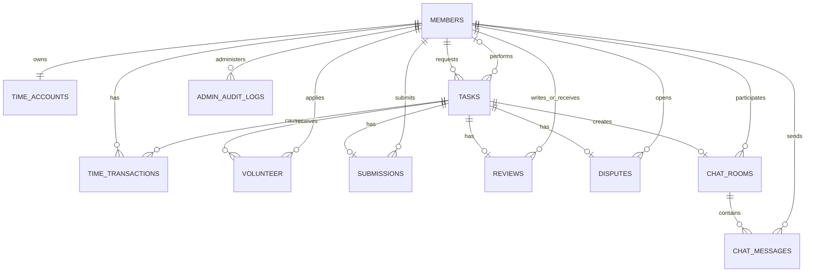

# D3BUG 데이터베이스 스키마 설계서

## 1. 문서 개요

이 문서는 D3BUG 긴급 업무 매칭 플랫폼의 데이터 구조, 테이블 관계, 제약조건, 인덱스, 데이터 보존 정책을 정리한 문서다.

| 항목 | 내용 |
|---|---|
| DBMS | PostgreSQL 15+ (Supabase PostgreSQL) |
| 스키마 관리 | Flyway V1~V13 |
| 애플리케이션 매핑 | Spring Data JPA / Hibernate |
| 시간 저장 | `TIMESTAMPTZ`로 저장, 사용자 화면은 `Asia/Seoul` 기준 표시 |
| 품 저장 단위 | 분(`INTEGER`), 1품 = 30분 |
| 파일 저장 | Supabase Storage에 원본 파일 저장, DB에는 경로와 메타데이터 저장 |

스키마의 기준 원본은 `src/main/resources/db/migration`의 Flyway SQL이다. JPA 엔티티는 이 스키마를 사용하며, 운영 환경에서는 `ddl-auto`로 스키마를 임의 변경하지 않고 Flyway 버전으로 관리한다.

## 2. 전체 데이터 관계



핵심 관계는 다음과 같다.

- 회원 한 명은 품 계정 하나를 가진다.
- 업무 한 건에는 요청자 한 명과 선택된 작업자 최대 한 명이 연결된다.
- 여러 회원이 하나의 업무에 지원할 수 있지만, 같은 회원은 같은 업무에 한 번만 지원할 수 있다.
- 제출물, 후기, 분쟁, 채팅방은 업무 한 건당 최대 한 건만 존재한다.
- 채팅방에는 요청자와 작업자만 참여하며 여러 메시지를 가진다.
- 관리자 조치는 별도 감사 원장에 누적한다.

## 3. 테이블 정의

### 3.1 `members` — 회원 및 프로필

| 컬럼 | 형식 | 필수 | 설명 |
|---|---|---:|---|
| `id` | BIGSERIAL | Y | 회원 PK |
| `email` | VARCHAR(255) | Y | 로그인 이메일, UNIQUE |
| `password_hash` | VARCHAR(255) | Y | 암호화된 비밀번호 |
| `nickname` | VARCHAR(30) | Y | 서비스 표시 이름, UNIQUE |
| `introduction` | VARCHAR(1000) | N | 자기소개 |
| `profile_image_url` | VARCHAR(1000) | N | 프로필 이미지 위치 |
| `portfolio_url` | VARCHAR(1000) | N | 포트폴리오 링크 |
| `skill_tags` | VARCHAR(50)[] | Y | 기술 태그 배열 |
| `notification_enabled` | BOOLEAN | Y | 알림 수신 여부 |
| `role` | VARCHAR(10) | Y | `USER`, `ADMIN` |
| `status` | VARCHAR(10) | Y | `ACTIVE`, `SUSPENDED`, `WITHDRAWN` |
| `completed_task_count` | INTEGER | Y | 완료 업무 수 캐시 |
| `review_count` | INTEGER | Y | 받은 후기 수 캐시 |
| `rating_sum` | INTEGER | Y | 평점 합계 캐시 |
| `terms_agreed_at` | TIMESTAMPTZ | Y | 이용약관 동의 시각 |
| `privacy_agreed_at` | TIMESTAMPTZ | Y | 개인정보 동의 시각 |
| `last_login_at` | TIMESTAMPTZ | N | 최근 로그인 시각 |
| `created_at`, `updated_at` | TIMESTAMPTZ | Y | 생성·수정 시각 |

평균 평점은 별도 컬럼으로 중복 저장하지 않고 `rating_sum / review_count`로 계산한다. 회원 상태가 `SUSPENDED`이면 인증 단계에서 로그인을 차단한다.

### 3.2 `tasks` — 업무

| 컬럼 | 형식 | 필수 | 설명 |
|---|---|---:|---|
| `id` | BIGSERIAL | Y | 업무 PK |
| `requester_id` | BIGINT | Y | 등록 회원 FK |
| `worker_id` | BIGINT | N | 선택된 작업자 FK |
| `title` | VARCHAR(120) | Y | 업무 제목 |
| `description` | TEXT | Y | 상세 설명 |
| `category` | VARCHAR(30) | Y | 업무 카테고리 |
| `required_skill_tags` | VARCHAR(50)[] | Y | 필요 기술 태그 |
| `requested_minutes` | INTEGER | Y | 등록·정산 기준 시간 |
| `deadline_at` | TIMESTAMPTZ | Y | 마감 시각 |
| `deliverable_description` | VARCHAR(500) | Y | 완료 기준 |
| `revision_limit` | INTEGER | Y | 허용 수정 횟수, 0~10 |
| `reference_file_url` | VARCHAR(1500) | N | 참고 파일 경로 |
| `caution` | VARCHAR(1000) | N | 주의 사항 |
| `status` | VARCHAR(20) | Y | 업무 진행 상태 |
| `matched_at` ~ `cancelled_at` | TIMESTAMPTZ | N | 단계별 발생 시각 |
| `created_at`, `updated_at` | TIMESTAMPTZ | Y | 생성·수정 시각 |

`requested_minutes`는 양수이며 30분 단위여야 한다. 요청자와 작업자는 같을 수 없고, 마감은 생성 시각보다 늦고 생성 후 24시간 이내여야 한다.

카테고리 값은 `PRESENTATION`, `DEVELOPMENT`, `DOCUMENT_REVIEW`, `TRANSLATION`, `INTERVIEW`, `PORTFOLIO`, `DESIGN`, `DATA`, `ETC`로 제한한다.

### 3.3 `time_accounts` — 현재 품 잔액

| 컬럼 | 형식 | 필수 | 설명 |
|---|---|---:|---|
| `member_id` | BIGINT | Y | 회원 PK/FK, 계정당 한 행 |
| `available_minutes` | INTEGER | Y | 사용 가능한 품(분) |
| `reserved_minutes` | INTEGER | Y | 업무에 예약된 품(분) |
| `version` | BIGINT | Y | 낙관적 잠금 버전 |
| `created_at`, `updated_at` | TIMESTAMPTZ | Y | 생성·수정 시각 |

두 잔액은 음수가 될 수 없고 30분 단위여야 한다. 이 테이블은 빠른 잔액 조회용 현재 상태이며, 변경 근거는 반드시 `time_transactions`에 함께 기록한다.

### 3.4 `time_transactions` — 품 거래 원장

| 컬럼 | 형식 | 필수 | 설명 |
|---|---|---:|---|
| `id` | BIGSERIAL | Y | 거래 PK |
| `account_member_id` | BIGINT | Y | 대상 품 계정 FK |
| `task_id` | BIGINT | N | 관련 업무 FK |
| `transaction_group_id` | VARCHAR(64) | Y | 한 업무 처리에 속한 거래 묶음 |
| `transaction_type` | VARCHAR(30) | Y | 거래 유형 |
| `available_delta_minutes` | INTEGER | Y | 가용 잔액 증감 |
| `reserved_delta_minutes` | INTEGER | Y | 예약 잔액 증감 |
| `available_balance_after` | INTEGER | Y | 거래 후 가용 잔액 |
| `reserved_balance_after` | INTEGER | Y | 거래 후 예약 잔액 |
| `idempotency_key` | VARCHAR(100) | Y | 중복 처리 방지 키, UNIQUE |
| `related_transaction_id` | BIGINT | N | 취소·역거래 대상 FK |
| `reason` | VARCHAR(500) | Y | 거래 사유 |
| `created_at` | TIMESTAMPTZ | Y | 거래 발생 시각 |

거래 유형은 `SIGNUP_REWARD`, `TASK_RESERVE`, `TASK_SETTLEMENT_DEBIT`, `TASK_SETTLEMENT_CREDIT`, `TASK_REFUND`, `ADMIN_CREDIT`, `ADMIN_DEBIT`, `REVERSAL`이다.

이 원장은 append-only다. 일반 `UPDATE`와 `DELETE`는 DB 트리거가 차단하며 잘못된 거래는 기존 행을 고치지 않고 `REVERSAL` 행을 추가해 보정한다. 업무 삭제 시에는 원장을 삭제하지 않고 `task_id`만 `NULL`로 바꾸는 `ON DELETE SET NULL` 정책을 사용한다. 따라서 관리자 화면의 과거 거래 이력은 업무가 삭제되어도 유지된다.

### 3.5 `volunteer` — 업무 지원자

| 컬럼 | 형식 | 필수 | 설명 |
|---|---|---:|---|
| `id` | BIGSERIAL | Y | 지원 PK |
| `task_id` | BIGINT | Y | 대상 업무 FK |
| `member_id` | BIGINT | Y | 지원 회원 FK |
| `message` | VARCHAR(500) | N | 지원 메시지 |
| `status` | VARCHAR(20) | Y | `APPLIED`, `ACCEPTED`, `REJECTED`, `CANCELLED` |
| `created_at`, `updated_at` | TIMESTAMPTZ | Y | 생성·수정 시각 |

`(task_id, member_id)`가 UNIQUE이므로 한 회원이 같은 업무에 중복 지원할 수 없다. 업무 또는 회원 삭제 시 지원 기록은 함께 삭제된다.

### 3.6 `submissions` — 결과물 제출

| 컬럼 | 형식 | 필수 | 설명 |
|---|---|---:|---|
| `id` | BIGSERIAL | Y | 제출 PK |
| `task_id` | BIGINT | Y | 업무 FK, UNIQUE |
| `worker_id` | BIGINT | Y | 제출 작업자 FK |
| `result_description` | TEXT | Y | 작업 결과 설명 |
| `result_file_url` | VARCHAR(1500) | N | 결과 파일 위치 |
| `actual_minutes` | INTEGER | Y | 실제 작업 시간(통계·분쟁 참고용) |
| `requester_note` | VARCHAR(1000) | N | 요청자 메모 |
| `created_at`, `updated_at` | TIMESTAMPTZ | Y | 생성·수정 시각 |

`actual_minutes`는 정산 금액을 바꾸지 않는다. 정산은 업무의 `requested_minutes`를 기준으로 한다.

### 3.7 `reviews` — 후기

| 컬럼 | 형식 | 필수 | 설명 |
|---|---|---:|---|
| `id` | BIGSERIAL | Y | 후기 PK |
| `task_id` | BIGINT | Y | 업무 FK, UNIQUE |
| `reviewer_id` | BIGINT | Y | 작성 회원 FK |
| `reviewee_id` | BIGINT | Y | 평가 대상 회원 FK |
| `rating` | SMALLINT | Y | 1~5점 |
| `content` | VARCHAR(1000) | N | 후기 내용 |
| `deadline_met` | BOOLEAN | N | 마감 준수 여부 |
| `created_at` | TIMESTAMPTZ | Y | 작성 시각 |

작성자와 평가 대상은 같을 수 없다.

### 3.8 `disputes` — 신고·분쟁

| 컬럼 | 형식 | 필수 | 설명 |
|---|---|---:|---|
| `id` | BIGSERIAL | Y | 분쟁 PK |
| `task_id` | BIGINT | Y | 업무 FK, UNIQUE |
| `opened_by_member_id` | BIGINT | Y | 분쟁 제기 회원 FK |
| `dispute_type` | VARCHAR(50) | Y | 분쟁 유형 |
| `description` | TEXT | Y | 신고·분쟁 내용 |
| `evidence_url` | VARCHAR(1500) | N | 증빙 파일 위치 |
| `status` | VARCHAR(20) | Y | 처리 상태 |
| `resolution_note` | TEXT | N | 관리자 처리 내용 |
| `resolved_at` | TIMESTAMPTZ | N | 종결 시각 |
| `created_at`, `updated_at` | TIMESTAMPTZ | Y | 생성·수정 시각 |

상태는 `OPEN`, `UNDER_REVIEW`, `RESOLVED`, `REJECTED`다. 진행 상태에서는 `resolved_at`이 없어야 하고, 해결 또는 기각 상태에서는 반드시 값이 있어야 한다. 해결된 건은 처리 목록에서 제외하되 데이터는 삭제하지 않아 감사 이력과 함께 추적한다.

### 3.9 `chat_rooms` — 업무 채팅방

| 컬럼 | 형식 | 필수 | 설명 |
|---|---|---:|---|
| `id` | BIGSERIAL | Y | 채팅방 PK |
| `task_id` | BIGINT | Y | 업무 FK, UNIQUE |
| `requester_member_id` | BIGINT | Y | 요청자 FK |
| `worker_member_id` | BIGINT | Y | 작업자 FK |
| `task_title` | VARCHAR(120) | Y | 표시용 업무 제목 스냅샷 |
| `last_message_preview` | VARCHAR(500) | N | 최근 메시지 미리보기 |
| `last_message_at` | TIMESTAMPTZ | N | 최근 메시지 시각 |
| `requester_left` | BOOLEAN | Y | 요청자 나가기 여부 |
| `worker_left` | BOOLEAN | Y | 작업자 나가기 여부 |
| `created_at`, `updated_at` | TIMESTAMPTZ | Y | 생성·수정 시각 |

요청자와 작업자는 같을 수 없다. 실제 DB에는 이전 버전 호환을 위한 `task_status`, `unread_message_count` 컬럼도 남아 있지만 현재 JPA `ChatRoom`의 핵심 읽기 모델에는 직접 매핑하지 않는다.

### 3.10 `chat_messages` — 채팅 메시지

| 컬럼 | 형식 | 필수 | 설명 |
|---|---|---:|---|
| `id` | BIGSERIAL | Y | 메시지 PK |
| `room_id` | BIGINT | Y | 채팅방 FK |
| `sender_id` | BIGINT | Y | 발신 회원 FK |
| `content` | VARCHAR(2000) | Y | 메시지 본문(파일만 전송 시 빈 문자열 가능) |
| `attachment_name` | VARCHAR(255) | N | 원본 파일명 |
| `attachment_object_path` | VARCHAR(1500) | N | Storage 객체 경로 |
| `attachment_content_type` | VARCHAR(150) | N | MIME 타입 |
| `attachment_size` | BIGINT | N | 파일 크기(byte) |
| `sent_at` | TIMESTAMPTZ | Y | 전송 시각 |
| `read_at` | TIMESTAMPTZ | N | 상대 사용자가 실제 채팅방을 확인한 시각 |
| `moderated_by_admin_id` | BIGINT | N | 조치한 관리자 FK |
| `moderation_reason` | VARCHAR(500) | N | 관리자 조치 사유 |
| `moderated_at` | TIMESTAMPTZ | N | 조치 시각 |
| `system_notification` | BOOLEAN | Y | 시스템 알림 메시지 여부 |

본문과 첨부 파일이 모두 없는 메시지는 CHECK 제약조건으로 차단한다. 채팅방 삭제 시 메시지는 함께 삭제되며, 발신 회원과 조치 관리자는 `ON DELETE RESTRICT`로 보호한다. `attachment_path`는 이전 버전 호환을 위한 레거시 컬럼이며 신규 코드는 `attachment_object_path`를 사용한다.

### 3.11 `admin_audit_logs` — 관리자 처리 이력

| 컬럼 | 형식 | 필수 | 설명 |
|---|---|---:|---|
| `id` | BIGSERIAL | Y | 감사 로그 PK |
| `admin_member_id` | BIGINT | Y | 처리 관리자 FK |
| `action` | VARCHAR(60) | Y | 처리 유형 |
| `target_type` | VARCHAR(40) | Y | 대상 종류 (`MEMBER`, `TASK`, `DISPUTE` 등) |
| `target_id` | BIGINT | Y | 대상 PK |
| `details` | VARCHAR(1000) | Y | 작업 상세 |
| `created_at` | TIMESTAMPTZ | Y | 처리 시각 |

`target_type`과 `target_id`는 여러 테이블을 가리키는 논리적 참조이므로 물리 FK를 만들지 않는다. 관리자 삭제로 감사 주체가 사라지지 않도록 `admin_member_id`는 `ON DELETE RESTRICT`다.

## 4. 주요 상태 흐름

### 업무 상태

```text
OPEN → MATCHED → IN_PROGRESS → SUBMITTED → COMPLETED
  └──────────────────────────────→ CANCELLED
                    └────────────→ DISPUTED
```

- `OPEN`: 지원자를 받는 상태
- `MATCHED`: 작업자 선택 완료
- `IN_PROGRESS`: 작업 진행 중
- `SUBMITTED`: 결과 제출 완료, 요청자 승인 대기
- `COMPLETED`: 승인 및 품 정산 완료
- `CANCELLED`: 취소 및 예약 품 반환 완료
- `DISPUTED`: 신고·분쟁 처리 중

상태 변경은 단순 화면 값 변경이 아니라 품 예약·반환·정산, 채팅 시스템 알림, 단계별 시각 기록과 같은 부수 작업을 같은 서비스 트랜잭션에서 처리해야 한다.

### 품 흐름

```text
회원가입: available +120분
업무 등록: available -요청분, reserved +요청분
업무 수정: 변경 차이만큼 available/reserved 조정
업무 삭제·취소: reserved -요청분, available +요청분
업무 완료: 요청자 reserved 차감, 작업자 available 증가
```

한 요청에서 `time_accounts`의 현재 잔액과 `time_transactions`의 원장 행을 같은 DB 트랜잭션으로 저장한다. 재시도 요청은 `idempotency_key` UNIQUE 제약으로 중복 차감을 막는다.

## 5. 삭제 및 보존 정책

| 데이터 | 삭제 정책 | 이유 |
|---|---|---|
| 회원 | 주요 업무·거래·채팅 관계가 있으면 RESTRICT | 이력과 책임 주체 보존 |
| 업무 | 일반 관계는 RESTRICT, 지원자는 CASCADE | 정산·제출·분쟁 무결성 유지 |
| 업무 연결 거래 | 업무 삭제 시 `task_id`만 SET NULL | 품 원장 영구 보존 |
| 채팅방 | 메시지 CASCADE | 방 단위 데이터 정리 |
| 관리자 감사 로그 | 누적 보존 | 관리자 처리 추적 |
| 해결된 분쟁 | 물리 삭제하지 않음 | 처리 이력 및 사후 검증 |

운영 서비스에서는 회원 탈퇴도 즉시 물리 삭제보다 `WITHDRAWN` 상태 전환과 개인정보 비식별화를 우선한다.

## 6. 제약조건과 동시성

- 이메일과 닉네임은 UNIQUE로 중복 가입을 방지한다.
- 업무별 제출·후기·분쟁·채팅방은 각각 UNIQUE FK로 최대 한 건만 허용한다.
- 업무별 회원 지원은 `(task_id, member_id)` 복합 UNIQUE로 중복을 차단한다.
- 품 잔액·증감은 30분 단위이며 음수 잔액을 허용하지 않는다.
- `time_accounts.version`은 동시 갱신 충돌 감지에 사용한다.
- 서비스 계층은 잔액 변경 구간에서 계정 행을 잠그고 검증한 뒤 원장과 함께 커밋해야 한다.
- 품 원장은 DB 트리거로 직접 수정·삭제를 막는다.
- `idempotency_key`는 네트워크 재시도나 중복 클릭에 따른 이중 거래를 방지한다.

사용자가 늘어나면 가장 먼저 경합이 발생할 수 있는 지점은 같은 회원의 품 계정과 인기 업무의 지원/매칭 처리다. 현재 제약조건과 잠금은 정합성을 우선하며, 부하 증가 시 짧은 트랜잭션 유지, 재시도 정책, 이벤트 큐 기반 후처리 순으로 확장한다.

## 7. 주요 인덱스

| 인덱스 | 목적 |
|---|---|
| `idx_members_skill_tags` | 기술 태그 GIN 검색 |
| `idx_tasks_status_deadline` | 모집 상태 및 마감순 목록 |
| `idx_tasks_category_status` | 카테고리별 모집 업무 조회 |
| `idx_tasks_requester_created` | 회원이 등록한 업무 최신순 조회 |
| `idx_tasks_required_skill_tags` | 필요 기술 태그 GIN 검색 |
| `idx_time_transactions_account_created` | 회원별 거래 원장 최신순 조회 |
| `idx_time_transactions_group` | 동일 정산 묶음 추적 |
| `idx_time_transactions_task_account_created` | 업무·회원별 조정 이력 조회 |
| `idx_volunteer_task_id`, `idx_volunteer_member_id` | 업무별 지원자·회원별 지원 내역 |
| `idx_disputes_status_created` | 미해결 분쟁 최신순 조회 |
| `idx_chat_rooms_*_updated` | 참여자별 채팅방 목록 |
| `idx_chat_messages_room_sent` | 채팅방 메시지 시간순 조회 |
| `idx_chat_messages_moderated_at` | 관리자 조치 메시지 조회 |
| `ix_admin_audit_created`, `ix_admin_audit_admin` | 전체·관리자별 처리 이력 최신순 조회 |

관리자 검색에서 닉네임·이메일 부분 검색량이 커질 경우 PostgreSQL `pg_trgm` 확장과 GIN 인덱스를 추가하는 방안을 검토한다. 현재 페이지네이션은 회원 20건, 업무 30건, 거래 원장 50건, 관리자 이력 20건 단위로 애플리케이션에서 제한한다.

## 8. 파일 저장소 연동

DB에는 파일 바이너리를 저장하지 않는다.

```text
브라우저 업로드
  → Spring 서버의 파일 형식·크기 검증
  → 서버가 Supabase Storage 비공개 버킷에 업로드
  → DB에 object path, 원본명, MIME type, 크기 저장
  → 조회 권한 확인 후 제한 시간 서명 URL 발급
```

업무 참고 파일은 `tasks.reference_file_url`, 결과 파일은 `submissions.result_file_url`, 분쟁 증빙은 `disputes.evidence_url`, 채팅 첨부는 `chat_messages.attachment_object_path`에 위치 정보를 저장한다. Storage의 서비스 역할 키는 서버 환경변수로만 관리하며 HTML, JavaScript, Git 저장소에 노출하지 않는다.

## 9. Flyway 변경 이력

| 버전 | 변경 내용 |
|---|---|
| V1 | 회원, 업무, 품 계정/원장, 제출, 후기, 분쟁 및 기본 제약·인덱스 생성 |
| V2 | 업무 채팅방과 메시지 생성 |
| V3 | 채팅 미읽음 수 컬럼·제약 보완 |
| V4 | 기존 DB의 미읽음 수 NULL 데이터 보정 |
| V5 | 채팅 첨부 파일 메타데이터 컬럼 보완 |
| V6 | 업무 수정 때 품 조정 원장을 여러 번 기록할 수 있도록 기존 복합 UNIQUE 제거 |
| V7 | 업무 지원자 테이블 생성 |
| V8 | 채팅 첨부 경로와 현재 JPA 모델 정렬, 파일 전용 메시지 허용 |
| V9 | 업무 삭제 후에도 품 거래 원장 보존 |
| V10 | 채팅방 참여자별 나가기 상태 추가 |
| V11 | 관리자 처리 감사 로그 생성 |
| V12 | 채팅 메시지 관리자 조치 정보 추가 |
| V13 | 채팅 시스템 알림 여부 추가 |

새로운 스키마 변경은 기존 파일을 수정하지 않고 다음 버전의 SQL 파일로 추가한다. 운영 DB에 적용된 migration checksum을 임의로 바꾸면 Flyway 검증이 실패할 수 있으므로, 기존 마이그레이션 수정이 꼭 필요할 때는 데이터 영향 검토와 이력 정합화 절차를 별도로 수행한다.

## 10. 현재 보완 과제

1. `volunteer`와 `chat_rooms`의 `updated_at` 갱신 주체를 애플리케이션 또는 DB 트리거 중 하나로 통일한다.
2. 채팅의 레거시 컬럼(`attachment_path`, `task_status`, `unread_message_count`)은 데이터 이전 여부를 검증한 뒤 별도 마이그레이션으로 정리한다.
3. 관리자 감사 로그의 `target_type`과 `action`을 코드 상수 또는 별도 코드 테이블로 표준화한다.
4. 거래·채팅 데이터 증가 시 보존 기간, 아카이빙, 파티셔닝 기준을 정의한다.
5. 대규모 관리자 검색을 대비해 이메일·닉네임 부분 검색 인덱스를 추가한다.
6. DB 백업 복원 훈련과 Flyway 적용 전 스테이징 검증을 배포 절차에 포함한다.

## 11. 운영 점검 기준

- 애플리케이션 시작 시 Flyway가 V13까지 정상 검증되는가?
- JPA 검증 결과와 실제 DB 컬럼·제약조건이 일치하는가?
- 모든 품 변경에 대응하는 원장 행이 존재하고 잔액이 재계산 결과와 일치하는가?
- 완료·취소·분쟁 처리 중 일부 단계만 반영된 데이터가 없는가?
- 삭제된 업무의 거래 원장이 유지되는가?
- 정지 회원의 인증과 보호 자원 접근이 차단되는가?
- 관리자 조치가 `admin_audit_logs`에 남는가?
- Storage 객체와 DB 경로 사이에 고아 데이터가 없는가?
- 모든 화면 시각이 한국 기준으로 일관되게 표시되는가?
